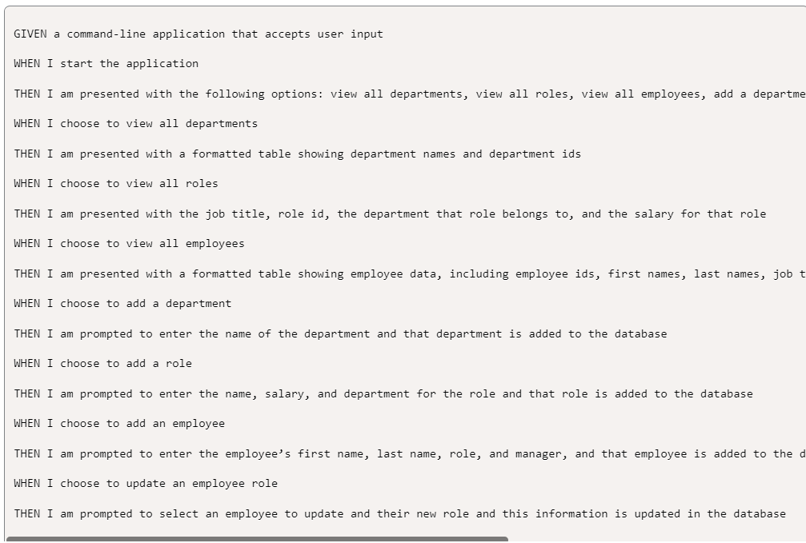
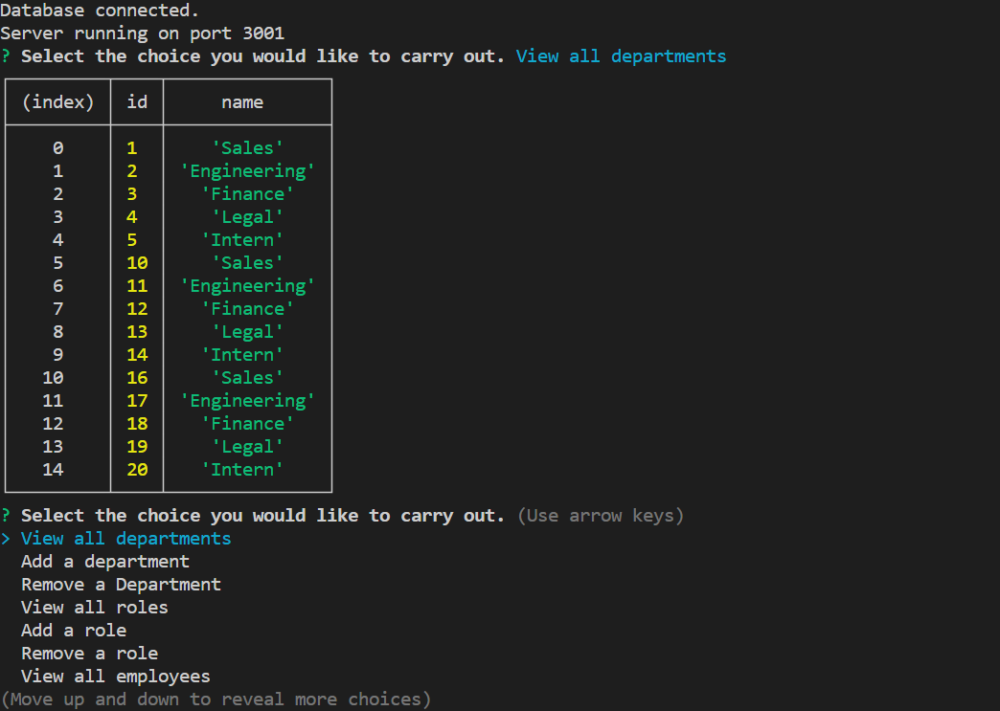

# employee-locator

## General Info
USER STORY:
    As a business owner I want to be able to view and manage the departments, roles, and employees in my company
    SO THAT I can organize and plan my business.

## Tools Used
This project required javascript, node, express, inquirer, and mysql.

### How to Run the Program
1. Install mysql2, console.table, and inquirer (and any other packages) in your terminal
2. Make sure the connection.js file has your mysql username and password filled into the corresponding fields
3. Open mysql using mysql -u root -p and then typing in your password
4. Get the database using USE employee_tracker
5. Add in the schema: source db/schema.sql
6. Add in the seeds file: source db/seeds.sql
7. Quit mysql
8. In the terminal type in node server.js
9. Answer the prompts as you like to generate the tables you wish to see
10. Repeat

## Screenshots
Here is an example of what the departments table would look like if that was the choice selected.

## Links
Github repository: https://github.com/hvphan1993/employee-locator.git

Video walkthrough: https://drive.google.com/file/d/1C2z3Kq5BPX56RlvGp6BlhcGW5JyhKXF0/view
